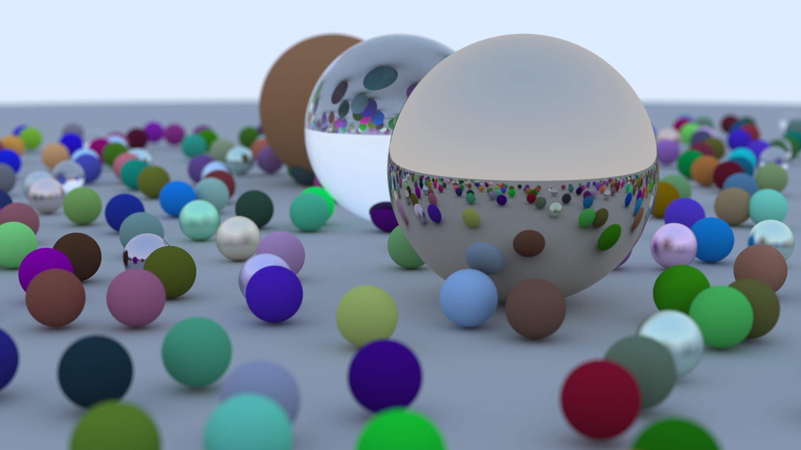

# Ray Tracing in Rust

An rust implementation of ray tracing from scratch.

## Features

* Material:
  * Lambertian
  * Metal
  * Dielectric
* Camera
  * Defocus Blur

## Output

## References

[_Ray Tracing in One Weekend_](https://raytracing.github.io/books/RayTracingInOneWeekend.html)